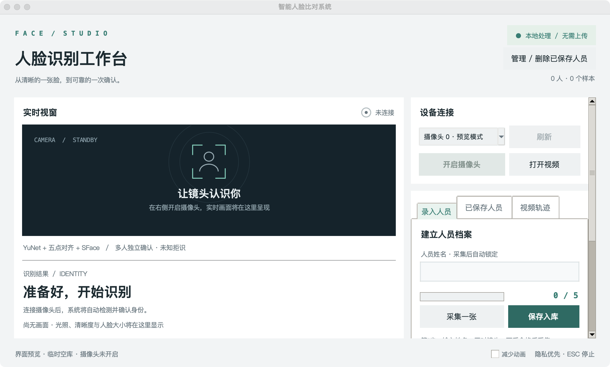

# 开放集多人脸识别系统

[](./README.md)
[](./README.en.md)
[](https://github.com/Ziqian-Zhu/open-set-face-recognition/actions/workflows/tests.yml)



*临时空库的实际运行界面；摄像头未开启，不包含真人照片、姓名或人脸向量。*

## 项目简介

这是一个基于 Python 和 OpenCV 的本地开放集人脸识别项目，面向摄像头实时画面与本地视频。它不仅查找“最像谁”，还要判断画面中的人是否已录入、当前画质是否足够，以及识别结果是否需要继续观察几帧才能确认。画面中出现多个人时，系统会分别处理每张脸和对应的轨迹。

项目将**人脸检测 → 关键点对齐 → 质量检查 → 特征提取 → 向量检索 → 开放集判定 → 多帧确认**串成可操作的桌面应用。`face_compare_system` 负责人员录入、实时识别、视频回放和本地数据管理；`face_research` 用于研究有限样本下的模板选择、阈值校准与性能取舍。YuNet 和 SFace 是预训练模型，本项目的重点是围绕它们构建完整、可解释、可测试的识别系统。

## 项目亮点

- **从画面到特征的完整链路：** YuNet 在一帧中检测多张人脸并给出五点关键点；通过人脸对齐和画质检查后，SFace 提取可用于比较的特征向量。检测、画质不合格的情况会单独处理，不直接当作“陌生人”。
- **开放集身份判定：** 匹配不仅看最近的样本，还按人员聚合多个模板的距离，并同时检查最佳身份的距离与前两名身份的差距。库中没有这个人，或两个身份过于接近时，系统可以拒识或继续确认。
- **多人独立跟踪与多帧确认：** 将位置和外观信息结合，为画面中的人脸维持各自轨迹；每条轨迹独立累计识别结果，再由连续帧决定是否显示稳定身份，避免仅凭单帧波动直接确认。
- **兼顾外观变化的录入流程：** 同一人可保存多张样本，也可混合录入戴镜、摘镜状态。录入时检查模糊、亮度、重复采集及身份冲突，避免把明显不合适的样本直接写入人员库。
- **面向实际使用的桌面交互：** 提供摄像头选择、实时预览、采集进度、人员管理及本地视频回放。界面中的“未知”“待确认”和画质提示对应不同处理状态，不把所有未识别结果混为一类。
- **本地存储与检索优化：** SQLite 保存人员和人脸向量；缓存与批量化精确检索减少多身份匹配时的重复计算。推理任务优先处理最新画面，整个识别流程可在本机 CPU 运行。
- **独立的研究与评估模块：** `face_research` 比较不同模板选样方法，并提供阈值校准、模型对照和性能测试入口。应用功能与实验流程分开，便于复现、分析和继续扩展。

### 量化对照

与只返回最近邻的单图 Demo 相比，本项目增加了画质门禁、未知身份拒识、多人独立轨迹和多帧确认。这是**功能设计差异**，并非经过同数据、同硬件对测的外部准确率排名；下面的数字只与本项目的基线比较。

| 对照 | 结果 | 边界 |
| --- | --- | --- |
| 旧版逐身份标量聚合 → 分组批量精确检索 | 1,000 个合成身份 × 每人 3 个模板，检索 p50 **9.381 → 0.289 ms，提速 32.44×**；1,200 次查询的完整分数和排名一致，36,000 次最终判定一致。[最终复验](docs/audits/FINAL_AUDIT_V2.md) | 这是检索耗时，不是相机帧率或识别准确率提升。 |
| 旧 Laplacian 模糊门槛 → 分区、噪声校正的画质指标 | 同一公开样例降对比度后，旧方差 **42.62 < 55** 被拒；新细节分 **0.676 > 0.30** 通过，而模拟失焦图 **0.103 < 0.30** 仍被拒。[质量回归记录](face_compare_system/验证记录.md) | 这是公开图和合成退化的回归案例，不等于真人采集通过率提升。 |
| 固定工程阈值 → 仅用验证集校准的阈值 | 公开戴镜／摘镜 **1:1** 测试中，可用同人配对接受数 **78/89 → 88/89**；按全部同人尝试为 **88/200**。[配对验证](face_research/VERIFICATION_RESULTS.md) | 这是探索性 1:1 对照，不代表线上多人 1:N 效果；测试可用异人仅 44 组，无法证明低误接风险。 |

工程回归测试 **454/454 通过**，覆盖开放集边界、多人轨迹、数据库与检索一致性等。[验收记录](docs/audits/FINAL_AUDIT_V2.md) 有完整范围。有限模板选样属于研究模块：目前自定义 Coverage 策略没有超过 First-K 基线（13/24 对 14/24），因此不把它包装成精度提升。[选样结果](face_research/P2_RETRIEVAL_RESULTS.md)

## 启动方式

需要 Python 3.10+ 和 Tk 8.6+；摄像头演示还需要可用相机。在仓库根目录运行（macOS / Linux）：

```bash
make bootstrap
make run
```

`make bootstrap` 会创建隔离环境、安装依赖并下载及校验模型；之后识别可离线进行。启动后打开摄像头，先录入人员，再进行识别。完整命令、Windows 安装与操作说明见 [应用指南](face_compare_system/README.md)，文档索引见 [docs](docs/README.md)。
